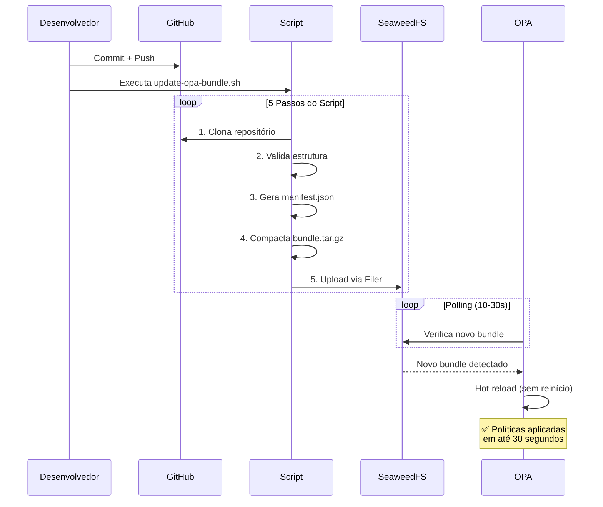
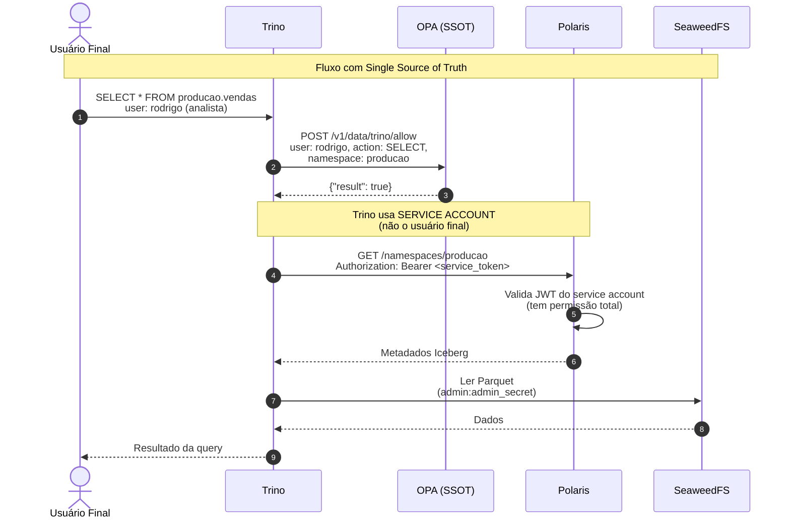
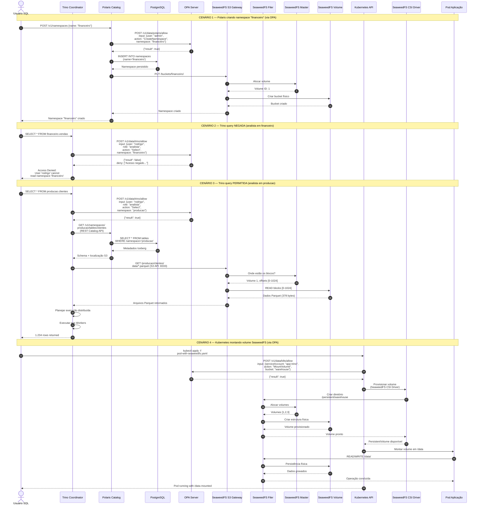
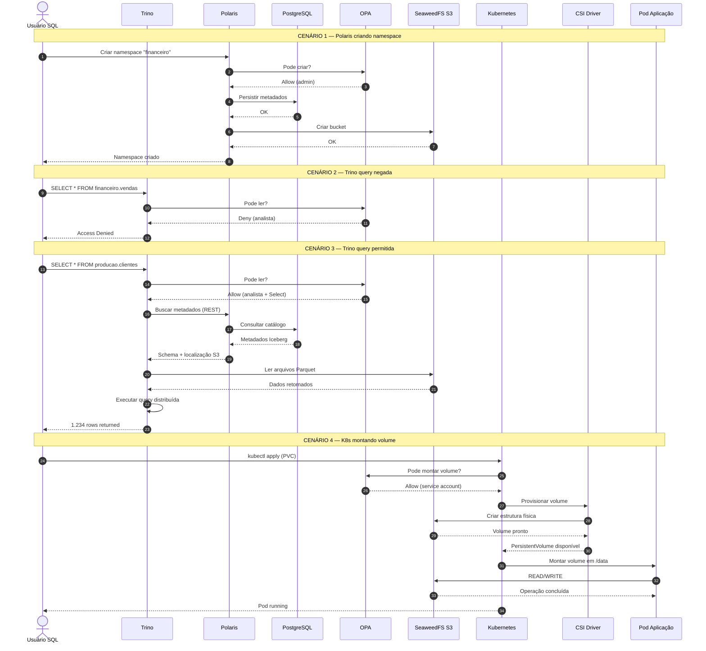

## Requitements do projeto

Instalação das dependências do projeto:
```bash
ansible-galaxy install -r requirements.yml
```
---

## Arquitetura IaC

```text
seaweed-trino-lab-data-lakehouse/
├── ansible/
│   ├── inventory/
│   │   └── hosts.ini              # IPs das VMs e grupos Ansible
│   │
│   ├── roles/
│   │   ├── common/                # Configurações básicas (rede, pacotes, utilitários)
│   │   ├── seaweed/               # SeaweedFS (Master, Volume, Filer e S3)
│   │   ├── opa/                   # Open Policy Agent (Autenticação e Autorização)
│   │   ├── postgres/              # Banco de metadados do Hive
│   │   ├── polaris/               # Polaris
│   │   ├── trino/                 # Engine SQL distribuída
│   │   └── k3s-seaweed-csi/       # Kubernetes leve + CSI Driver (opcional)
│   │
│   ├── ansible.cfg                # Ajustes do Ansible
│   └── playbook.yml               # Orquestração principal
│
├── tests/                         # Scripts de validação do laboratório
│   ├── trino-test.md
│   ├── kubernetes-test.md
│   ├── postgres-test.md
│   ├── seaweed-test.md
│   ├── opa-test.md
│   └── polaris-test.md
│
├── docs/                          # Diagramas e documentação técnica
│   ├── arquitetura/
│   ├── fluxogramas/
│   └── kubernetes/
│
├── Vagrantfile                    # Provisionamento das VMs locais
├── setup.sh                       # Execução automatizada do laboratório
├── destroy.sh                     # Destruição do ambiente
├── .gitignore                     # Exclusão de arquivos temporários
├── update-opa-bundle.sh           # Script de Atualização de Bundle OPA via GitHub
└── README.md                      # Guia técnico do projeto
```

---

## Panorama Comportamental

```text
┌─────────────────────────────────────────────────────────────┐
│                    CONSULTA OPA (Obrigatória)                 │
└─────────────────────────────────────────────────────────────┘
                              ↓
┌──────────┐    ┌──────────┐    ┌──────────┐    ┌──────────┐
│  Trino   │    │  Polaris │    │   K8s    │    │   S3     │
│  (SQL)   │    │ (Catalog)│    │ (Volume) │    │ (Auth)   │
└──────────┘    └──────────┘    └──────────┘    └──────────┘
     ↓               ↓               ↓               ↓
  Query SQL    Create Table    Mount Volume    Read/Write
     ↓               ↓               ↓               ↓
  ✅/❌ OPA      ✅/❌ OPA      ✅/❌ OPA      ✅/❌ Auth
     ↓               ↓
     ↓         ┌──────────┐
     └────────>│PostgreSQL│ (Catálogo Iceberg)
               └──────────┘
```
---

## Verificação dos serviços SeaweedFS

| Serviço               | URL                                       | Descrição                                               |
|-----------------------|-------------------------------------------|---------------------------------------------------------------------------|
| SeaweedFS Master      | http://192.168.56.101:9333                | Painel de status do cluster (volumes ativos, health checks)               |
| SeaweedFS Filer       | http://192.168.56.101:8888                | Interface web tipo "Google Drive" para navegar pelo arquivos do data lake |
| SeaweedFS S3 Gateway  | http://192.168.56.101:8333                | Endpoint compatível com S3 (retorna XML com informações do bucket)        |
| Apache Polaris        | http://192.168.56.101:8182/q/health/ready | Health Check saudável e perfeitamente conectado ao PostgreSQL |
| Trino                 | http://192.168.56.102:8080        | Interface web do Trino (login: `admin`, sem senha)                        | 

## Diagramas

### Diagrama de Sequência - Fluxo GitOps do Bundle OPA



### Diagrama de Sequência - Fluxograma da Pipiline


### Diagrama de Sequência — Governança OPA entre Frameworks


### Diagrama de Sequência — Governança OPA entre Frameworks (Simplificada)


## Caso não faça sentido o K8 ao seu projeto:

### 1. Remover do ansible/enventory/hosts.ini  
```bash
[k8s]
k8s-node ansible_host=192.168.56.103 ansible_user=vagrant ansible_ssh_private_key_file=.vagrant/machines/k8s-node/virtualbox/private_key
```

### 2. Remover do ansible/playbook.yml
```bash
- name: "Configuração do Nó Kubernetes (VM 3)"
  hosts: k8s
  become: yes
  roles:
    - role: k8s-seaweed-csi
      tags: k8s-seaweed-csi
```

### 3. Remover do `Vagrantefile`
```bash
# VM 3: Kubernetes Node (K3s)
  config.vm.define "k8s-node" do |node|
    node.vm.box = "ubuntu/focal64"
    node.vm.hostname = "k8s-node"
    node.vm.network "private_network", ip: "192.168.56.103"
    node.vm.provider "virtualbox" do |vb|
      vb.memory = "1024"
      vb.cpus = 1
      vb.name = "k8s-node"
    end
  end
```

### 4. Remover do `setup.sh` apenas o ***"k8s-node:key_k8s"*** do `for` de dentro do loop.
```bash
# Adicionei a VM3 (k8s-node) que planejamos anteriormente na lista
for VM in "seaweedfs-node:key_seaweed" "trino-sea-node:key_trino" "k8s-node:key_k8s"; do
  VM_NAME="${VM%%:*}"
  KEY_NAME="${VM##*:}"
  DEST="$SSH_DIR/$KEY_NAME"
  ```

## Outros comandos

### Utilizando TAGs Ansible-Playbook
```bash
ansible-playbook -i ansible/inventory/hosts.ini ansible/playbook.yml --tags "seaweed"

# ou

./setup.sh --tags seaweed
```

### Como executar o script update-opa-bundle.sh na máquina remota

```bash
# 1. Copiar o script para o servidor
scp -o StrictHostKeyChecking=no ./update-opa-bundle.sh fnadmin@143.244.201.207:~/

# 2. Conectar via SSH (pela VPN)
 ssh fnadmin@143.244.201.207 -o StrictHostKeyChecking=no

# 3. Dar permissão de execução
chmod +x ~/update-opa-bundle.sh

# 4. Executar
~/update-opa-bundle.sh https://github.com/ericsonbarbosa/opa-policies.git main

# Necessário instalar o AWS CLI na máquina que está rodando o script
sudo apt-get install -y awscli

# Configurar AWS CLI com as credenciais do SeaweedFS (ficam armazendas em ~/.aws/credentials)
aws configure set aws_access_key_id "admin"
aws configure set aws_secret_access_key "admin_secret"
aws configure set default.region "us-east-1"

# script + repositório git
./update-opa-bundle.sh https://github.com/ericsonbarbosa/opa-policies.git

# caso haja uma brach específica basta acrecentar ao final da uri
./update-opa-bundle.sh https://github.com/ericsonbarbosa/opa-policies.git main

```